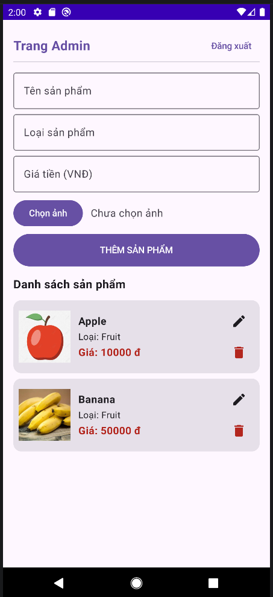
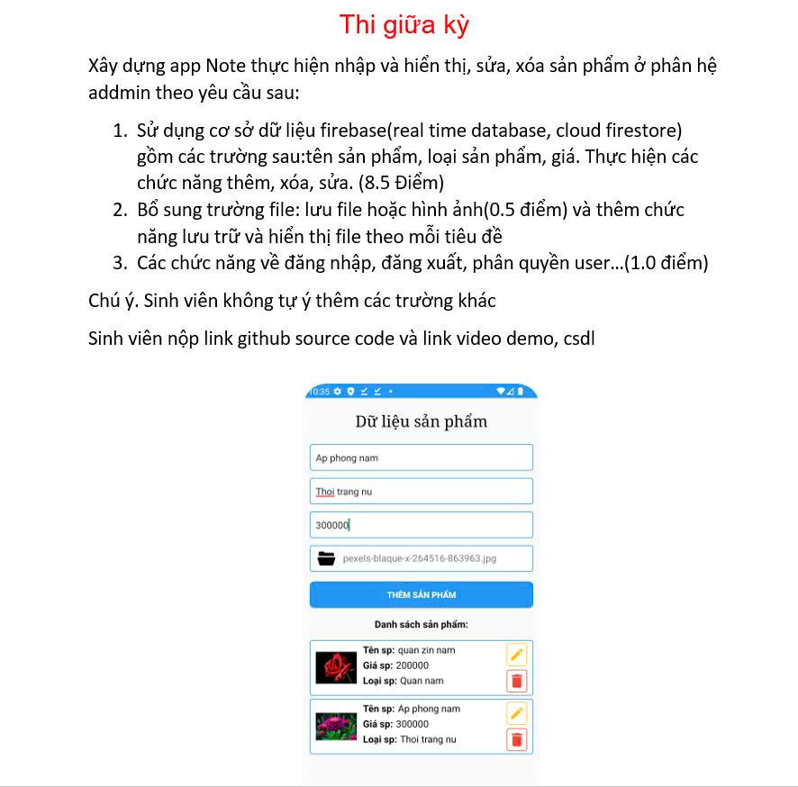

# Simple IAM Item Management on Android with Kotlin and Jetpack Compose

## Problem

## Features
* Identity and Access Management with Firebase Authentication: Only admin can add, edit and remove items
* Register account with email verification
* Logging in, restoring password

## Demo
https://github.com/Fannovel16/Midterm-MobileDev-Kotlin/raw/refs/heads/main/demo_lite.mp4
